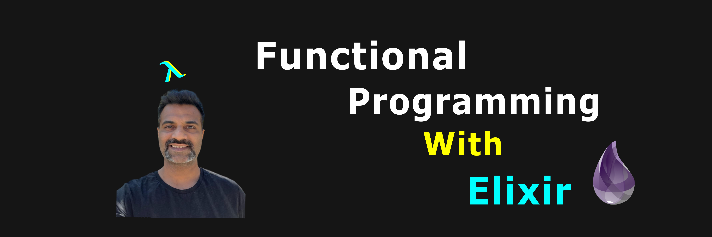

# Basic Tutorials - Functional Programming With Elixir

Learn the basics of functional programming by creating a mix Tutorial project.

## Sequence -

1. Recursion -
   1. Print Digits
   2. Sum Digits
   3. Factorial
   4. Reverse Num
2. Lists
3. Structs -
   1. Seven Wonders
   2. Expense Manager

## Connect

[www.octallium.com](https://www.octallium.com/)

[@octallium](https://twitter.com/octallium)